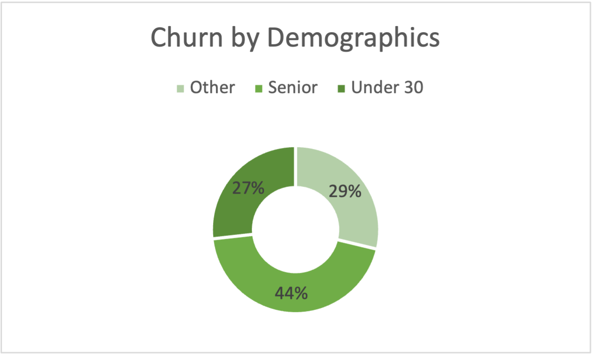

# Customer Churn Analysis (Excel)  

## Overview  
This project analyzes **customer churn data** using Microsoft Excel. The goal is to understand which factors contribute to churn, identify customer risk profiles, and summarize insights through an **interactive Excel dashboard**.  

Two datasets were used:  
1. **Customer Dataset** → individual-level data (one row per customer)  
2. **Aggregate Dataset** → grouped and summarized data (e.g., by demographics, contracts, etc.)  

The analysis was done entirely in Excel using **PivotTables, PivotCharts, formulas, conditional formatting, and slicers**.  

---

## Dataset  

### Customer-Level Dataset (Individual Records)  
Columns include:  
- **Customer ID** – Unique customer identifier  
- **Churn Label** – Whether the customer churned (Yes/No)  
- **Account Length (months)** – Duration of customer relationship  
- **Local Calls / Local Mins** – Domestic call activity  
- **Intl Calls / Intl Mins** – International call activity  
- **Intl Active / Intl Plan** – International usage & subscription status  
- **Extra International Charges** – Extra charges beyond plan  
- **Customer Service Calls** – Support interactions  
- **Avg Monthly GB Download** – Internet usage  
- **Unlimited Data Plan** – Yes/No indicator  
- **Extra Data Charges** – Charges beyond plan data  
- **Demographics** – State, phone number, gender, age, under 30, senior  
- **Group Info** – Group size, number of customers in group  
- **Device Protection & Online Backup** – Value-added services  
- **Contract Type** – Month-to-month, annual, etc.  
- **Payment Method** – How the customer pays  
- **Monthly Charge / Total Charges** – Billing information  
- **Churn Category / Churn Reason** – Categorized churn causes  
- **Churned** – Final churn outcome (Yes/No)  

### Aggregate Dataset (Grouped Records)  
Columns include:  
- **Unlimited Data Plan** – Aggregated churn by plan type  
- **Account Length (months)** – Average tenure  
- **Intl Active / Intl Plan** – Aggregated international usage  
- **Demographics** – State, gender, age, under 30, senior, group  
- **Contract Type / Payment Method** – Aggregated churn by contracts & payments  
- **Churn Category / Churn Reason** – Grouped churn drivers  
- **Total Customers / Churned Customers** – Counts for each group  
- **Avg Monthly Charges** – Average spend per customer  
- **Avg Customer Service Calls** – Average support interactions  
- **Avg Extra International Charges / Extra Data Charges** – Average add-on charges  
- **Avg Monthly GB Download** – Average data usage  
- **Grouped Consumption** – Summary of grouped usage  

---

## Methodology  
- **Data Cleaning** → Removed duplicates, checked missing values  
- **PivotTables** → Explored churn by demographics, tenure, usage, and billing  
- **Aggregate Analysis** → Used grouped dataset for higher-level churn insights  
- **Visualization** → Created bar charts, line graphs, pie charts, and KPIs  
- **Dashboard Creation** → Designed an interactive Excel dashboard with slicers  

---

## Dashboard Preview  

### Churn Overview  
  

### Churn by Demographics

### Churn by Monthly Charges  
  

### Full Interactive Dashboard  
  

---

## ⚙️ Tools Used  
- **Microsoft Excel**  
  - PivotTables & PivotCharts  
  - Conditional Formatting  
  - Slicers & Filters  
  - Formulas (IF, COUNTIF, AVERAGEIF, etc.)  

---

## 🚀 How to Use  
1. Clone or download this repository.  
2. Open `Customer_Churn_Analysis.xlsx`.  
3. Explore:  
   - **Raw Data Sheet** → Contains customer dataset  
   - **Aggregate Sheet** → Contains grouped dataset  
   - **Dashboard Sheet** → Interactive churn dashboard  
4. Use slicers/filters to drill down into churn insights.  

---

## 📌 Key Insights  
- Customers on **month-to-month contracts** churn at the highest rate.  
- **High monthly charges** and **extra usage fees** are major churn drivers.  
- Customers who contact **customer service frequently** are more likely to churn.  
- **Longer-tenure customers** and those with **Unlimited Data Plans** are more loyal.  
- Churn is heavily influenced by **contract type** and **payment method**.  

---

## 🔮 Future Improvements  
- Automate dataset refresh with **Power Query**  
- Build predictive churn scoring logic using Excel formulas  
- Extend dashboard with **revenue impact analysis**  

---

## 📝 License  
This project is licensed under the MIT License.  
