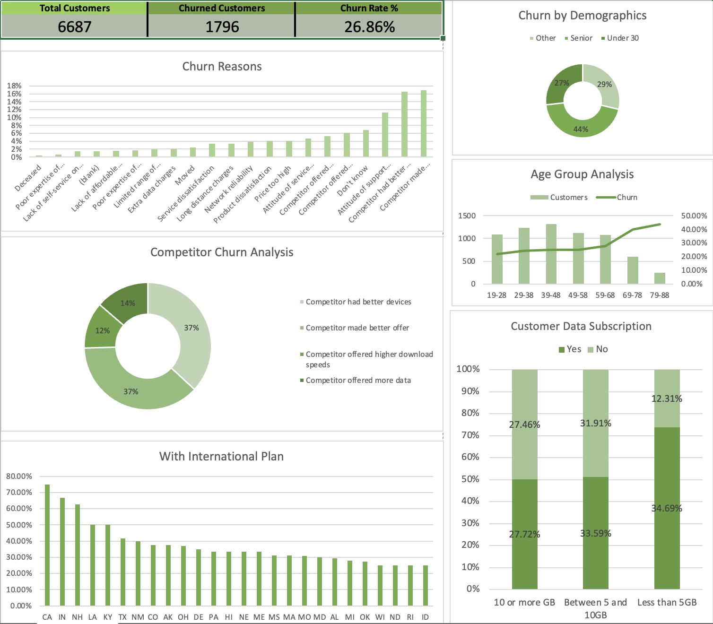

# Customer Churn Analysis (Excel)  

## Overview  
This project analyzes **customer churn data** using Microsoft Excel. The goal is to understand which factors contribute to churn, identify customer risk profiles, and summarize insights through an **interactive Excel dashboard**.  

Two datasets were used:  
1. **Customer Dataset** → individual-level data (one row per customer)  
2. **Aggregate Dataset** → grouped and summarized data (e.g., by demographics, contracts, etc.)  

The analysis was done entirely in Excel using **PivotTables, PivotCharts, formulas, conditional formatting, and slicers**.  

---

## Methodology  
- **Data Cleaning** → Removed duplicates, checked missing values  
- **PivotTables** → Explored churn by demographics, tenure, usage, and billing  
- **Aggregate Analysis** → Used grouped dataset for higher-level churn insights  
- **Visualization** → Created bar charts, line graphs, pie charts, and KPIs  
---

## Dashboard Preview  
  

---

## Key Insights  
- A lot of customers churned because other competitors made a better offer
- Most of the customers who churn are seniors
- The higher the age, the higher the chance of churn rate

---

## Future Improvements  
- Interactive dashboard using PowerBI
- Automate dataset refresh with **Power Query**  
- Build predictive churn scoring logic using Excel formulas  
- Extend dashboard with **revenue impact analysis**  
